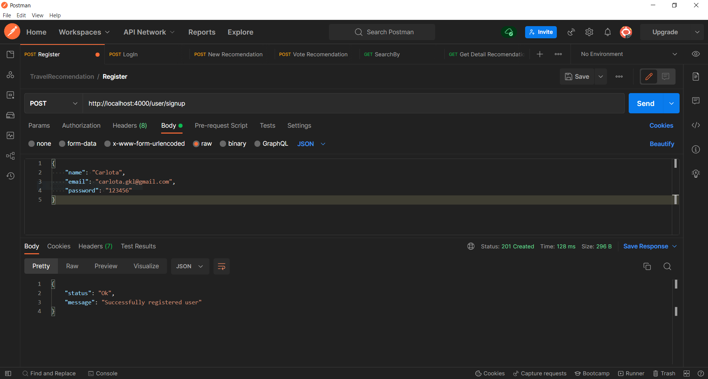
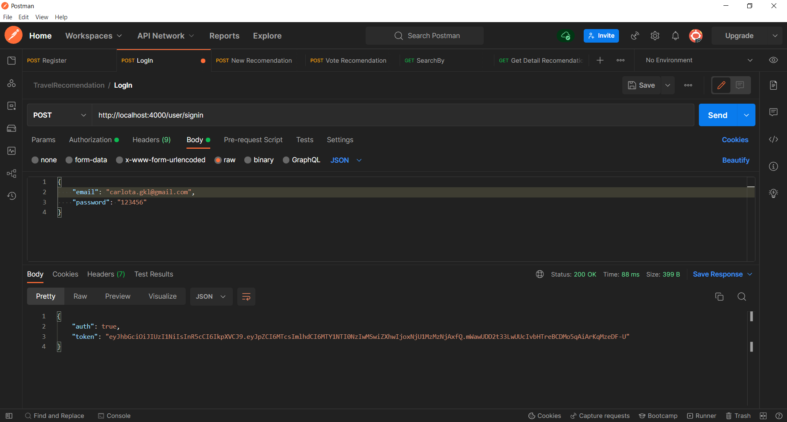
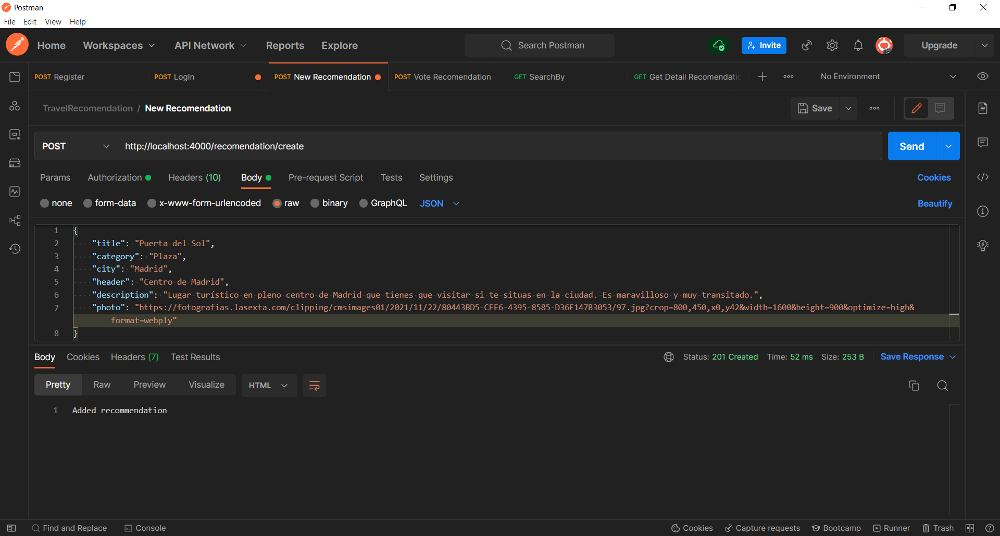
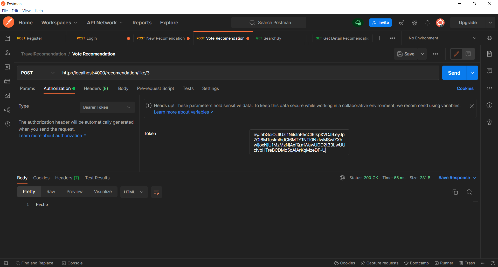
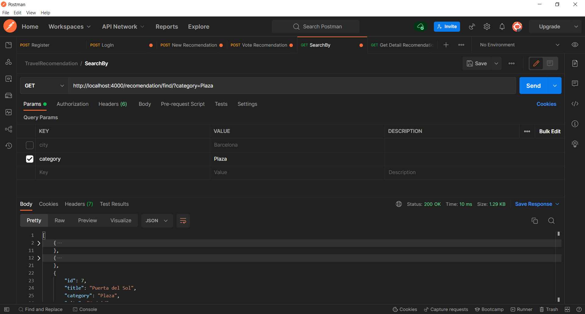
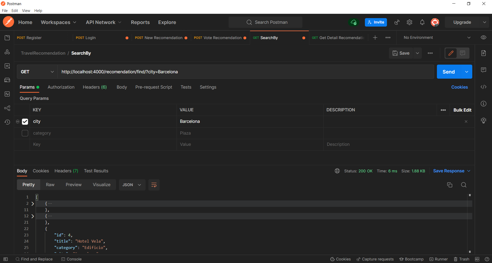

# RecomendationTravel

  <p align="center">
    API que permite gestionar un portal donde los usuarios pueden publicar recomendaciones de viaje de sitios o experiencias poco conocidas.
    <br>
  </p>
  <br>


## Table of contents

- [RecomendationTravel](#recomendationtravel)
  - [Table of contents](#table-of-contents)
  - [About The Project](#about-the-project)
  - [Quick start](#quick-start)
    - [Built With](#built-with)
  - [EndPoints](#endpoints)


<!-- ABOUT THE PROJECT -->
## About The Project

Recomendation Travel es una API donde permite que cualquier usuario pueda visualizar opiniones de otras personas sobre lugares de interés para viajar que hayan estado previamente en dicha ubicación. Para poder escribir tus propias recomendaciones, tendrás que registrarte y hacer SignIn en la aplicación y rellenar un formulario.
<br>
<br>


## Quick start

Para poder utilizar los servicios de la API, hay que hacer unas configuraciones previas.

- Modificar datos en un archivo .env del mismo modo que se especifíca en el archivo de ejemplo.
- Introducir las configuraciones de la base de datos proporcionados en el directorio database, en un documento .sql.
- A través de la consola de comandos, encender el servidor a través de la siguiente linea de comando.
```sh
  npm run start
```

<br>
<br>


### Built With

La API esta integramente desarrollada con NodeJS y su framework ExpressJS.

* [Node.js](https://nodejs.org/)
* [Express.js](https://expressjs.com/)


<!-- GETTING STARTED -->
## EndPoints

<b>EndPoint SignUp:</b>
```sh
  http://localhost:4000/user/signup
```



<hr>

<b>EndPoint SignIn:</b>
```sh
  http://localhost:4000/user/signin
```



<hr>

<b>EndPoint Create Recomendation:</b>
```sh
  http://localhost:4000/recomendation/create
```

* Para poder utilizar este endpoint necesitas haberte logeado previamente y obtener el Barer token que se proporciona.



<hr>

<b>EndPoint vote Recomendations:</b>
```sh
  http://localhost:4000/recomendation/like/:id
```

* Para poder utilizar este endpoint necesitas tener un Barer Token.



<hr>

<b>Endpoint Search by Category:</b>
```sh
  http://localhost:4000/recomendation/find/
```

* Para poder utilizar este endpoint necesitas pasar por Query el parametro category.



<hr>

<b>Endpoint Search by City:</b>
```sh
  http://localhost:4000/recomendation/find/
```

* Para poder utilizar este endpoint necesitas pasar por Query el parametro city.



<hr>
